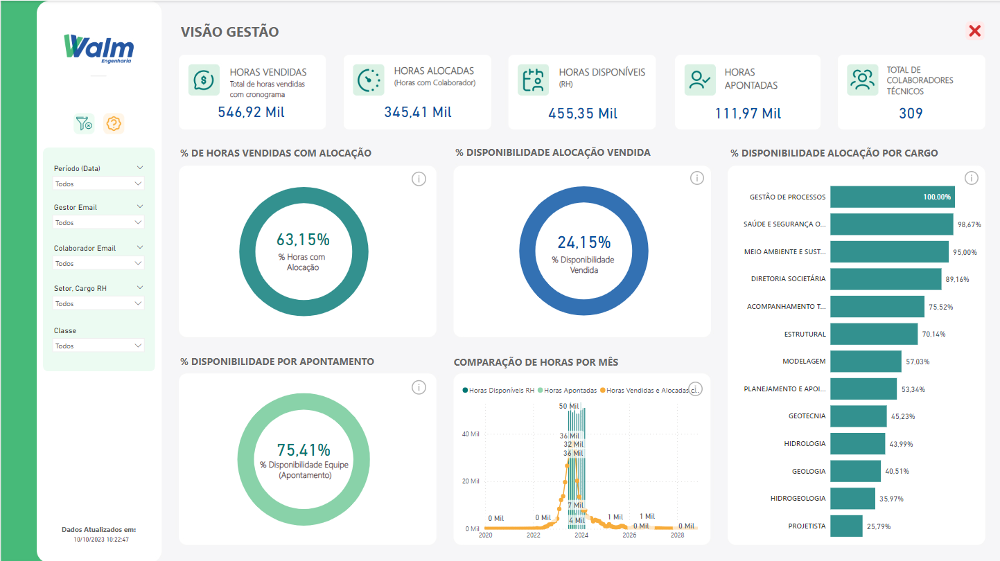
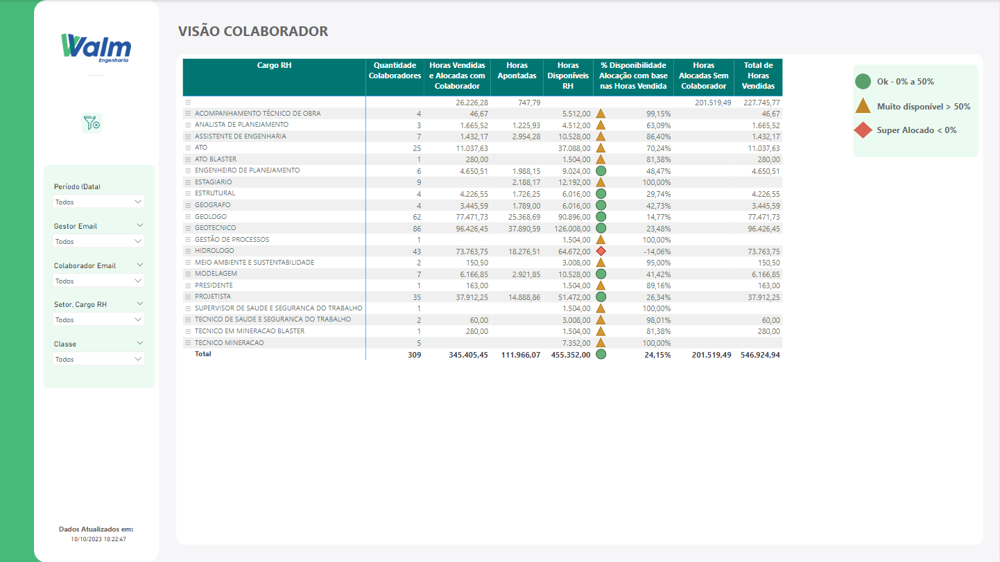
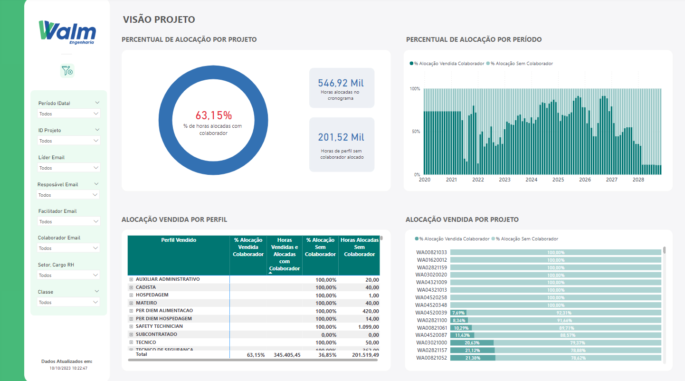
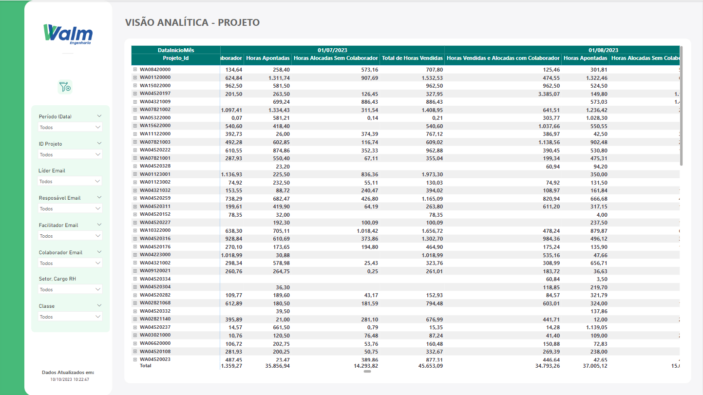
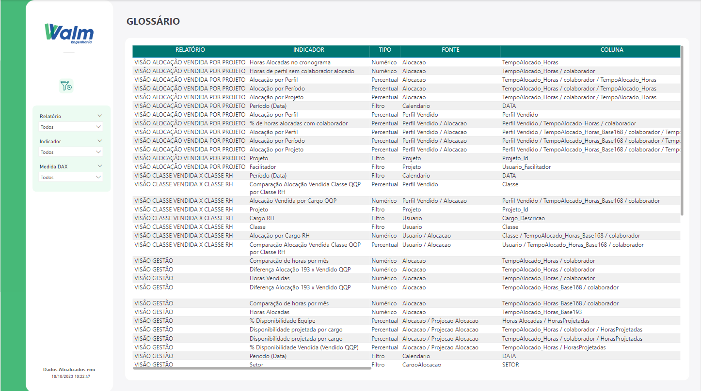

# Bem vindo(a)

Neste arquivo, é mantida a documentação do projeto Dashboard Alocação, desenvolvido em parceria entre a [A3Data](https://a3data.com.br/) e a [Walm Engenharia](https://a3data.com.br/).

A sua esquerda se encontra o menu das atividades desenvolvidas, como dashboards,  explicações sobre arquitetura utilizada, tecnologias, entre outros itens fundamentais para o sucesso do projeto.

Nesta documentação iremos apresentar:

* Glossário
* Definições
* Consumo de dados
* Dashboards desenvolvidos

Entre em contato 📫

Em caso de dúvidas sobre a documentação, termos técnicos, ambiguidades, grafias incorretas ou quaisquer problemas com este documento, por favor, entre em contato via e-mail  **eduardo.magalhaes@walmengenharia.com.br**

## Glossário

* **Alocação:**
Atribuição de mão de obra a tarefas ou finalidades específicas dentro do projeto/obra de engenharia para garantir que os recursos sejam usados de forma eficiente a fim de atender os objetivos e necessidades da organização dentro do projeto em execução.

* **BI:** 
Business Intelligence, conjunto de metodologias, processos e fluxos que junto da tecnologia faz com que os dados e informações resultem em estratégias para otimizar empresas e negócios.

* **Classe:**
É a categorização de um funcionário dentro de uma organização dentro de uma determinada posição. Existem, basicamente, (inserir qtde) classes de senioridade a serem consideradas no contexto do projeto elaborado: Júnior, Pleno, Sênior e Master. Outras classes, em paralelo, também foram consideradas para categorizar perfis de colaboradores que estão em treinamento ou desenvolvimento profissional dentro da empresa, como Estagiários e Trainees.

* **Dashboard:**
É um tipo de interface gráfica de usuário que geralmente fornece visualizações rápidas dos
principais indicadores de desempenho relevantes para um determinado objetivo ou processo
de negócios.

* **QQP:**
Refere-se ao Quadro de Quantidade de Preços, usado em engenharia e construção, para descrever um detalhamento de itens, quantidade de preços associados a um projeto de construção. É uma parte fundamental do processo de orçamento e estimativa de custos.

* **TT:**
Se refere a um período total de um ano, começando no início do ano (em janeiro) e terminando em dezembro. 

* **Year to date (YTD):**
Se refere a um período que começa no início do ano (em janeiro) e termina na data em que um relatório financeiro ou contábil é finalizado, como se fosse a expressão “do começo do ano até hoje” ou “acumulado do ano”.

## Definições

#### Partes envolvidas

* **Walm Engenharia**
A WALM BH Engenharia é uma empresa de reconhecido destaque no mercado, atuando nas áreas de Engenharia Geotécnica, Hidrologia, Hidráulica e Geologia. Atualmente, atende segmentos estratégicos e econômicos, como os de Mineração, Manufatura, Infraestrutura, Energia, Óleo e Gás, e Saneamento.
A WALM possui uma equipe técnica multidisciplinar, formada por engenheiros civis, geólogos, geógrafos, engenheiros ambientais, projetistas e desenhistas, amplamente capacitada, qualificada, com experiência prática e formação acadêmica adquiridas no Brasil e no exterior. No seu quadro técnico a empresa conta com especialistas, mestres e doutores e profissional com certificação QP/CP (Qualified Person/Competent Person) em Geotecnia pelo AusIMM – Australasian Institute of Mining and Metallurgy, para atendimento às normas JORC e NI 43-101.

* **A3 Data**
A A3Data é uma empresa especializada em projetos de Transformação Digital, Analytics e Inteligência Artificial, podendo contribuir de forma muito estratégica para os objetivos de seus parceiros. 

#### Equipe do Projeto

| Função             | Nome                                                |
|--------------------|-----------------------------------------------------|
| Sponsor            | André Simão (Walm)                                  |
| Product Owner (PO) | Pollyani Cristina de Oliveira e João Marcelo (Walm) |
| Analistas De Dados | Samuel Vilela e  Jackson Nascimento (A3Data)        |
| Líder De Projeto   | Ana Luísa Dos Santos Alves (A3Data)                 |
| CSM                | Flávia Almeida (A3Data)                             |

#### Software escolhido

O software escolhido para o desenvolvimento dos dashboards de interesse foi o [Power BI](https://powerbi.microsoft.com/pt-br/). O Power BI é uma plataforma de business intelligence (BI) desenvolvida pela Microsoft que permite aos usuários visualizar, analisar e compartilhar dados de forma interativa. Ele é uma ferramenta poderosa para transformar dados brutos em informações úteis, painéis de controle interativos e relatórios visuais.
O Power BI é amplamente utilizado em organizações para análises de dados, geração de relatórios, monitoramento de desempenho e tomada de decisões baseadas em dados. Ele é adequado para uma ampla gama de setores e pode ser usado por analistas de dados, profissionais de negócios e tomadores de decisão. É uma ferramenta versátil que pode transformar dados em insights acionáveis.

## Consumo de dados

## Dashboards

##### 1. Visão Gestão
O painel de Gestão oferece uma análise abrangente e visual do planejamento e controle de horas vendidas, alocadas e disponibilizadas por cargo para que se tenha um monitoramento e controle contínuo do progresso dos projetos em relação ao cronograma elaborado para realização das atividades.
Além desse objetivo central, o painel tem como objetivo secundário fazer o acompanhamento da distribuição de horas alocadas em cada projeto, o quantitativo apontado pelos colaboradores envolvidos, valor percentual de disponibilidade de cada equipe e o comparativo de horas vendidas e alocadas em determinado intervalo de tempo.
Representação Visual

A Figura (inserir número) mostra o layout do painel de Visão de Gestão. 

Figura (inserir número) - Layout Painel Visão de Gestão

Ele utiliza gráficos e métricas para apresentar as seguintes informações:

* **Horas Vendidas -** representa todas as horas vendidas(QQP) que estão vinculadas a um projeto (cronograma).
* **Horas Alocadas -** representa todas as horas vendidas que estão vinculadas a projetos com colaboradores.
* **Horas Disponíveis -** disponibilidade de trabalho do time técnico, representando todas as horas disponíveis dos colaboradores técnicos ativos.
* **Horas Apontadas -** horas registradas pelos colaboradores em cada projeto trabalhado.
* **Total de Colaboradores -** número de recursos disponíveis para alocar em projetos.
* **Percentual de horas vendidas com alocação -** representa, percentualmente, a proporção das horas vendidas com alocação de colaborador por projeto em relação ao total de horas vendidas em projetos.
* **Percentual de disponibilidade de alocação vendida -** representa, percentualmente, a proporção das horas vendidas com colaboradores alocados em projetos em relação às horas disponíveis pelo RH, expressa como um percentual.
* **Percentual de disponibilidade de alocação por cargo -** permite visualizar a disponibilidade de cada cargo técnico para possíveis alocações.
* **Percentual de disponibilidade por apontamento -** representa, percentualmente, a proporção das horas apontadas (realizadas) por projeto em relação às horas disponíveis pelo RH, expressa como um percentual.
* **Comparação de horas por mês -**  permite a visualização da evolução dos indicadores no período conforme seleção de data.

##### Filtros interativos

Para uma análise mais personalizada, oferecemos filtros interativos que permitem aos usuários selecionar um período específico e características do colaborador envolvido no projeto. Isso permite explorar os dados em detalhes e responder a perguntas específicas. Estão dentro das possibilidades de filtro as seguintes informações:

* Período (Data)
* Gestor do projeto
* Colaborador
* Setor de atuação
* Classe de senioridade

##### Funcionalidades extras
Além dos gráficos e métricas para análises assertivas em relação aos projetos em execução, o painel de Gestão possui duas funcionalidades extras:

* **Filtro de Limpeza Geral -** Botão que permite a limpeza de todos os filtros escolhidos ao longo da análise feita pelo usuário
* **Painel de Ajuda -** A tela auxiliar de ajuda, mostrada na Figura (inserir número),  permite que o usuário verifique algumas definições importantes a respeito dos gráficos e métricas calculados, assim como as variáveis utilizadas nos cálculos realizados.

Figura (inserir número) - Tela auxiliar de ajuda

##### 2. Visão Colaborador
O painel do Colaborador oferece uma análise mais específica sobre o status de alocação do colaborador por cargo exercido. O principal objetivo dessa visão é possibilitar a verificação de disponibilidade de horas de um colaborador com base nas horas vendidas em determinado projeto que ele atua. 
Além desse objetivo central, o painel tem como objetivos secundários verificar a quantidade de colaboradores envolvidos no projeto filtrado, valor de horas apontadas e disponíveis no RH, quantitativo de horas alocadas no projeto que estão sem colaborador e o total de horas vendidas.

##### Representação Visual

A Figura (inserir número) mostra o layout do painel de visão do colaborador.

Figura (inserir número correspondente) -  Layout Painel Visão por Colaborador

O painel possui, como informação principal,  uma tabela que oferece uma visão granular (a nível de senioridade por cargo disponível no RH ) das informações, permitindo que seja explorado os números em detalhes por cada colaborador, como a quantidade de colaboradores por senioridade, o valor de horas que foram vendidas e alocadas no projeto, a quantidade de horas que foram apontadas até a última data de atualização do Project Union, quantidade de horas que foram alocadas no projeto e estão sem colaborador e o total de horas que foram vendidas.

##### Indicadores 
O Percentual de disponibilidade de Alocação com Base nas Horas que foram vendidas em cada projeto é um indicador sinalizado no painel como um farol de sinalização. Para a elaboração desse farol, as seguintes regras de negócio foram consideradas:
*Para percentual de disponibilidade inferior a 0%, sinalizar farol em cor vermelha, representando uma super alocação;
*Para percentual de disponibilidade superior a 50%, sinalizar farol em cor amarela, representando uma alta disponibilidade;
*Para percentual de disponibilidade entre 0% e 50 %, sinalizar farol em cor verde, representando o cenário ideal de alocação.

##### Filtros interativos
Para uma análise mais personalizada, oferecemos filtros interativos que permitem aos usuários selecionar um período específico e características do colaborador envolvido no projeto. Isso permite explorar os dados em detalhes e responder a perguntas específicas. Estão dentro das possibilidades de filtro as seguintes informações:

* Período (Data)
* Gestor do projeto
* Colaborador
* Setor de atuação
* Classe de senioridade

##### 3. Visão Projeto
A visão de Projeto oferece uma análise mais detalhada sobre índices e características do projeto. O principal objetivo dessa visão é permitir a visualização do percentual de alocação em cada projeto. Além disso, é possível analisar quais colaboradores estão envolvidos no projeto, quanto da alocação vendida de cada colaborador já foi consumida e o quantitativo de horas que foram alocadas no projeto, porém estão sem alocação.

##### Representação Visual

A Figura (inserir número) mostra o layout do painel de visão por projeto.

Figura (inserir número correspondente) -  Layout Painel Visão Projeto

Ele utiliza gráficos e métricas para apresentar as seguintes informações:

* **Percentual de Alocação por projeto -** informa o percentual de horas que foram vendidas no projeto e estão alocadas com colaborador
* **Percentual de Alocação por período -** gráfico que informa, em uma faixa de tempo pré-selecionada, o percentual de alocação das horas que foram vendidas no projeto com colaborador e o percentual que está pendente de colaborador para preenchimento de alocação.
* **Alocação Vendida por perfil -** tabela que informa, de forma granular, a divisão dos perfis alocados e vendidos por projeto, mostrando por nível de senioridade de colaboradores alocados, o percentual de alocação vendida por colaborador, quanto do perfil está alocado com colaborador e quanto, percentualmente, está alocado sem colaborador.
* **Alocação Vendida por projeto -** gráfico que informa o percentual atual, por projeto, de alocação vendida com colaborador e o percentual com alocação pendente. 
* **Horas Alocadas no cronograma -** Quantitativo de horas do projeto que estão alocadas no cronograma.
* **Horas de perfil sem colaborador alocado -** Quantitativo de horas que foram vendidas no projeto, mas que estão sem colaborador alocado.

##### Filtros interativos
Para uma análise mais personalizada, oferecemos filtros interativos que permitem aos usuários selecionar um período específico e características do colaborador envolvido no projeto. Isso permite explorar os dados em detalhes e responder a perguntas específicas. Estão dentro das possibilidades de filtro as seguintes informações:

* Período (Data)
* Número do projeto
* Líder do projeto
* Facilitador
* Colaborador
* Setor de atuação
* Classe de senioridade

##### 4. Visão Analítica por Projeto
A visão Analítica por Projeto oferece uma análise mais detalhada sobre os projetos em andamento da empresa, em uma determinada faixa de tempo. Isso possibilita que o usuário possa analisar em determinado período de tempo algumas informações relevantes do projeto que atua ou lidera, com relação às horas apontadas, vendidas e alocadas.
Representação Visual

A Figura (inserir número) mostra o layout do painel de visão por projeto.

Figura (inserir número correspondente) -  Layout Painel Visão Analítica por Projeto

O painel possui, como informação principal, uma tabela que oferece uma visão granular (a nível de senioridade por cargo disponível no RH ) das informações de horas de cada projeto, permitindo que seja explorado os números em detalhes, por cada colaborador, de horas vendidas, apontadas e alocadas.
A cada nível da tabela, é possível analisar em cada projeto a quantidade de horas vendidas, alocadas com colaborador e apontadas para cada setor, classe de senioridade e colaborador em específico.

##### Filtros interativos
Para uma análise mais personalizada, oferecemos filtros interativos que permitem aos usuários selecionar um período específico e características do projeto. Isso permite explorar os dados em detalhes e responder a perguntas específicas. Estão dentro das possibilidades de filtro as seguintes informações:

* Período (Data)
* Número do projeto
* Líder do projeto
* Facilitador
* Colaborador
* Setor de atuação
* Classe de senioridade

##### 5. Classe Vendida x Classe RH
A visão Classe Vendida x Classe RH oferece uma análise comparativa entre o quantitativo de alocação de horas vendidas por cargo determinado na QQP e a alocação de cargo correspondente no RH. Além disso, é possível observar, percentualmente, a quantidade de alocação de cada classe de senioridade por projeto.
Representação Visual

A Figura (inserir número) mostra o layout do painel de visão por projeto.

Figura (inserir número correspondente) -  Layout Painel Classe Vendida x Classe RH

Ele utiliza gráficos e métricas para apresentar as seguintes informações:

* **Alocação vendida por cargo QQP -** informa a quantidade de horas vendidas por cada cargo na QQP
* **Alocação por cargo RH -** informa a quantidade de horas disponíveis por cada cargo no RH
* **Comparação Alocação Vendida Classe QQP por Classe RH -** informa um comparativo percentual entre a quantidade de horas vendidas na QQP e disponíveis no RH para cada senioridade de cada cargo disponível.

#####  Filtros interativos
Para uma análise mais personalizada, oferecemos filtros interativos que permitem aos usuários selecionar um período específico e características do projeto. Isso permite explorar os dados em detalhes e responder a perguntas específicas. Estão dentro das possibilidades de filtro as seguintes informações:

* Período (Data)
* Número do projeto
* Cargo disponível no RH
* Classe de senioridade

##### 6. Glossário
O Painel de glossário, mostrado na Figura (inserir número correto, é uma visão tabelar que permite auxiliar o usuário com a denominação de alguns campos do dashboard de alocação como um todo. Nele é possível entender qual o tipo de indicador foi criado, a tipagem do valor encontrado, a fonte utilizada para realização do cálculo e as colunas das tabelas de dados utilizadas para criação das medidas.

Figura (inserir número correspondente) -  Layout Painel Glossário

É importante ressaltar que todas essas informações foram disponibilizadas de forma filtrada por painel. Assim, o processo de filtragem para entendimento das medidas calculadas se tornaria mais otimizado.

## Link para acesso

Para explorar este dashboard e obter insights detalhados sobre a alocação, use o seguinte link: [Power BI - Dashboard Alocação](https://app.powerbi.com/Redirect?action=OpenApp&appId=65223f2a-c526-4850-b942-07c696e745bf&ctid=13f4fa63-d02e-4e99-a3fe-9b23b83e91ec)

O acesso do dashboard, inicialmente, estará disponível apenas para os planejadores  devido a disponibilidade de licença na plataforma. 
